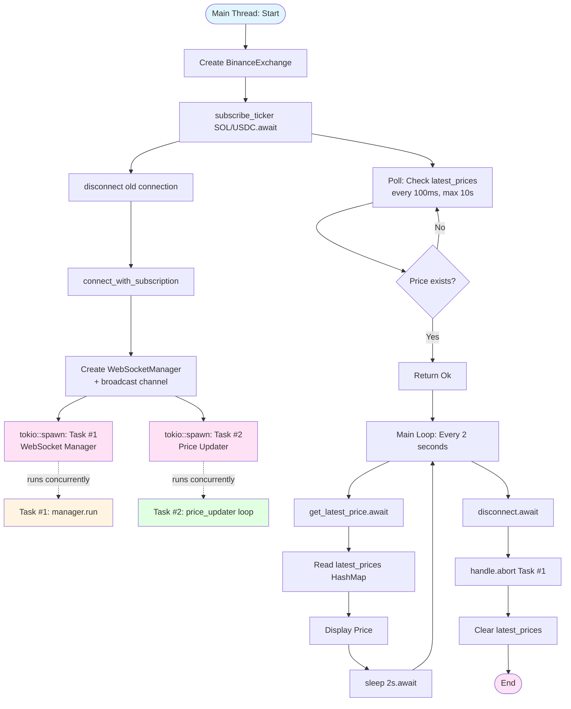
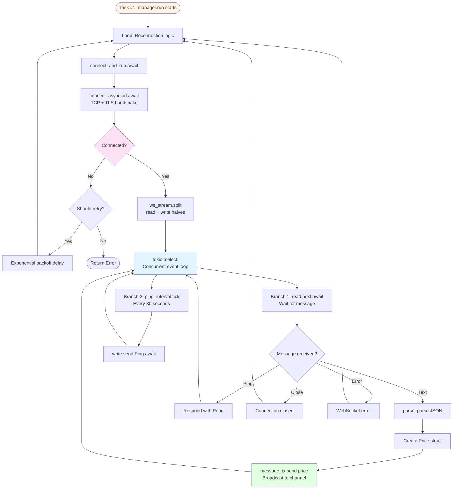
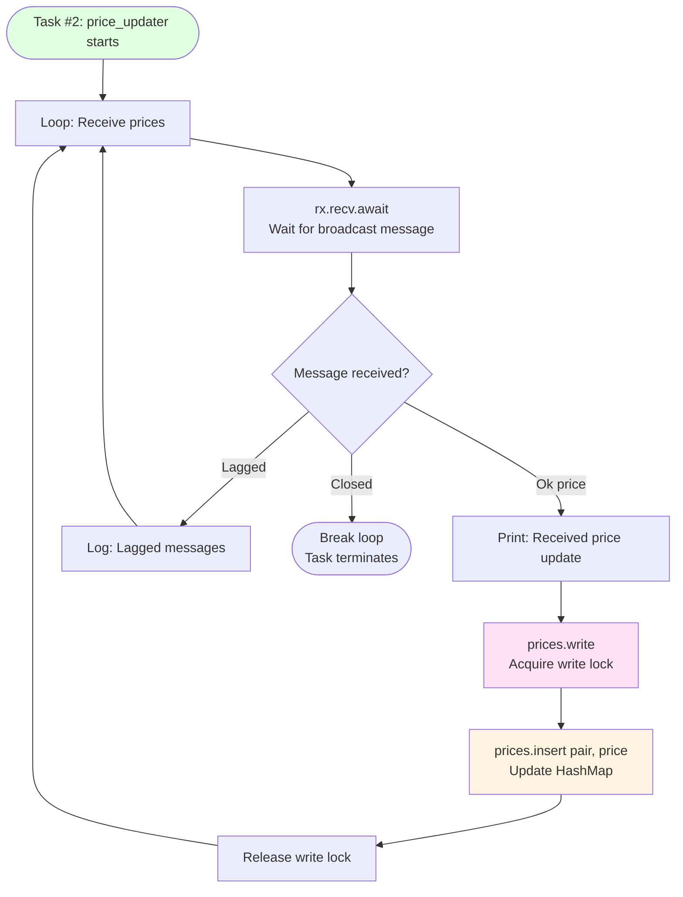
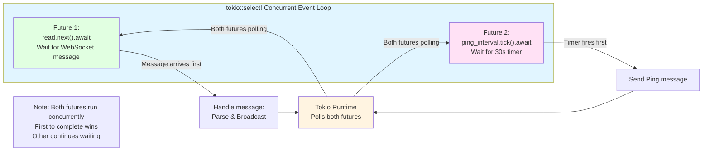

# Price Streaming Flow: From Subscription to Disconnection

## Complete Flow Diagrams

### Main Flow: Subscription to Disconnection



### Background Task #1: WebSocket Manager



### Background Task #2: Price Storage



### Data Flow: Price Journey

```mermaid
sequenceDiagram
    participant Binance as Binance Server
    participant WS as WebSocket Manager<br/>(Task #1)
    participant Parser as BinanceParser
    participant Channel as Broadcast Channel
    participant Storage as Price Updater<br/>(Task #2)
    participant HashMap as latest_prices<br/>(Arc&lt;RwLock&gt;)
    participant Main as Main Thread

    Binance->>WS: WebSocket Message<br/>(JSON text)
    WS->>Parser: parse JSON text
    Parser->>Parser: Extract: e, s, c, b, a, v<br/>Convert: SOLUSDC → SOL/USDC<br/>Parse decimals
    Parser->>WS: Return Price struct
    WS->>Channel: message_tx.send(price)

    Note over Channel: Non-blocking broadcast<br/>All receivers get message

    Channel->>Storage: rx.recv().await<br/>(receives Price)
    Storage->>HashMap: prices.write()<br/>Acquire write lock
    Storage->>HashMap: insert(pair, price)
    Storage->>HashMap: Release write lock

    Main->>HashMap: prices.read()<br/>Acquire read lock
    Main->>HashMap: get(pair)
    HashMap->>Main: Return cloned Price
    Main->>HashMap: Release read lock
    Main->>Main: Display price
```

### Architecture Overview: Threads & Shared State

```mermaid
graph TB
    subgraph MainThread["Main Thread (tokio::main)"]
        MainCode[User Code:<br/>subscribe_ticker<br/>get_latest_price<br/>disconnect]
    end

    subgraph Task1["Background Task #1: WebSocket Manager"]
        WSManager[WebSocketManager<br/>manager.run]
        WSConnection[WebSocket Connection<br/>Read/Write]
        ParserLogic[BinanceParser<br/>JSON → Price]
        TxSender[broadcast::Sender<br/>message_tx]
    end

    subgraph Task2["Background Task #2: Price Storage"]
        RxReceiver[broadcast::Receiver<br/>price_rx]
        PriceUpdater[Price Updater Loop<br/>rx.recv.await]
    end

    subgraph SharedState["Shared State"]
        ArcRwLock[Arc&lt;RwLock&lt;HashMap&gt;&gt;<br/>latest_prices]
        HashMapData[(HashMap&lt;String, Price&gt;<br/>"SOL/USDC" → Price)]
    end

    subgraph Channel["Broadcast Channel"]
        ChannelInternal[Capacity: 100<br/>1-to-many communication]
    end

    MainCode -->|creates| WSManager
    MainCode -->|spawns| Task1
    MainCode -->|spawns| Task2
    MainCode -->|reads| ArcRwLock

    WSManager --> WSConnection
    WSConnection -->|receives JSON| ParserLogic
    ParserLogic -->|creates Price| TxSender
    TxSender -->|sends| ChannelInternal

    ChannelInternal -->|broadcasts| RxReceiver
    RxReceiver --> PriceUpdater
    PriceUpdater -->|writes| ArcRwLock

    ArcRwLock --> HashMapData

    style MainThread fill:#e1f5ff
    style Task1 fill:#fff4e1
    style Task2 fill:#e1ffe1
    style SharedState fill:#ffe1f5
    style Channel fill:#f0e1ff
```

### Concurrent Operations: tokio::select!



## Step-by-Step Flow with Code

### Phase 1: Initialization (Main Thread)

**File:** `examples/binance_websocket_test.rs`

```rust
// Main thread, synchronous initialization
let mut exchange = BinanceExchange::new(config)?;
```

**What happens:**

- Creates `BinanceExchange` struct
- Initializes `latest_prices: Arc<RwLock<HashMap::new()>>`
- Sets `ws_manager_handle: None`, `price_rx: None`
- **Thread:** Main thread (synchronous)

---

### Phase 2: Subscription Setup (Async, Main Thread)

**File:** `src/exchanges/binance/exchange.rs:140`

```rust
exchange.subscribe_ticker("SOL/USDC").await?
```

**What happens:**

#### Step 2.1: Disconnect Previous (if any)

```140:142:src/exchanges/binance/exchange.rs
    async fn subscribe_ticker(&mut self, pair: &str) -> Result<()> {
        // Disconnect existing connection if any
        self.disconnect().await.ok();
```

- **Async:** Yes (`await`)
- **Thread:** Main thread
- Calls `disconnect()` to clean up previous connection

#### Step 2.2: Create WebSocket Connection

```68:82:src/exchanges/binance/exchange.rs
    async fn connect_with_subscription(&mut self, pair: &str) -> Result<()> {
        let symbol = Self::pair_to_symbol(pair);

        // Use the base_url configured (already set to Binance.US or Binance.com)
        // Format: wss://stream.binance.us/ws/<symbol>@ticker
        let url = format!("{}/{}@ticker", self.base_url, symbol);

        let parser = BinanceParser::new();
        let reconnect_strategy = ReconnectionStrategy::exponential_backoff();

        // Create WebSocket manager with subscription URL
        let (mut manager, price_rx) = WebSocketManager::new(url, parser, reconnect_strategy);

        // Store receiver
        self.price_rx = Some(price_rx);
```

**What happens:**

- Creates `WebSocketManager` with URL, parser, reconnect strategy
- `WebSocketManager::new()` creates a **broadcast channel**: `(tx, rx)`
- Stores `price_rx` in `self.price_rx`
- **Async:** No (synchronous setup)
- **Thread:** Main thread

#### Step 2.3: Spawn Background Task #1 (WebSocket Manager)

```84:91:src/exchanges/binance/exchange.rs
        // Spawn background task to run WebSocket manager
        let handle = tokio::spawn(async move {
            if let Err(e) = manager.run().await {
                eprintln!("Binance WebSocket manager error: {}", e);
            }
        });

        self.ws_manager_handle = Some(handle);
```

**What happens:**

- **`tokio::spawn()`**: Creates a new async task on Tokio runtime
- **Moves `manager`** into the spawned task (takes ownership)
- **Thread:** New background task (concurrent with main thread)
- **Async:** Yes (task runs `manager.run().await`)
- Stores `JoinHandle` to control/cancel the task later

#### Step 2.4: Spawn Background Task #2 (Price Updater)

```93:117:src/exchanges/binance/exchange.rs
        // Spawn background task to update latest prices from WebSocket stream
        if let Some(mut rx) = self.price_rx.take() {
            let prices = self.latest_prices.clone();
            tokio::spawn(async move {
                loop {
                    match rx.recv().await {
                        Ok(price) => {
                            println!(
                                "📊 Received price update: {} = bid:{}, ask:{}",
                                price.pair, price.bid, price.ask
                            );
                            prices.write().insert(price.pair.clone(), price);
                        }
                        Err(tokio::sync::broadcast::error::RecvError::Lagged(skipped)) => {
                            eprintln!("⚠️  Lagged {} messages", skipped);
                            continue;
                        }
                        Err(tokio::sync::broadcast::error::RecvError::Closed) => {
                            eprintln!("❌ Broadcast channel closed");
                            break;
                        }
                    }
                }
            });
        }
```

**What happens:**

- **`tokio::spawn()`**: Creates another background task
- **Clones `Arc`**: `self.latest_prices.clone()` (shares same HashMap)
- **Moves `rx`** into task (takes ownership)
- **Thread:** New background task (concurrent with Task #1 and main)
- **Loop:** Continuously waits for messages via `rx.recv().await`
- **When message arrives:**
  - Acquires **write lock** on `HashMap` (`prices.write()`)
  - **Inserts** price (overwrites old value for same pair)
  - Releases lock

---

### Phase 3: Wait for First Price (Async, Main Thread)

```147:167:src/exchanges/binance/exchange.rs
        // Wait for first price to arrive (max 10 seconds)
        // This ensures we have data before returning
        let mut attempts = 0;
        let max_attempts = 100; // 100 * 100ms = 10 seconds max wait

        while attempts < max_attempts {
            tokio::time::sleep(tokio::time::Duration::from_millis(100)).await;

            // Check if we have price data
            if self.latest_prices.read().contains_key(pair) {
                return Ok(());
            }

            attempts += 1;
        }
```

**What happens:**

- **Async sleep:** `sleep(Duration::from_millis(100)).await`
  - Yields control to Tokio runtime
  - Other tasks can run (Task #1 connecting, Task #2 receiving)
- **Read lock:** `self.latest_prices.read()` (non-blocking if no writer)
- **Checks:** If price exists in HashMap
- **Returns:** When price found or timeout
- **Thread:** Main thread

---

### Phase 4: Background Task #1 - WebSocket Connection

**File:** `src/websocket/manager.rs:106`

#### Step 4.1: Connection Loop

```106:125:src/websocket/manager.rs
    pub async fn run(&mut self) -> Result<()> {
        loop {
            match self.connect_and_run().await {
                Ok(_) => {
                    // Connection closed normally
                    return Ok(());
                }
                Err(e) => {
                    // Connection failed
                    if !self.reconnect_strategy.should_retry() {
                        return Err(e);
                    }

                    let delay = self.reconnect_strategy.next_delay();
                    tokio::time::sleep(delay).await;
                    // Loop continues to retry
                }
            }
        }
    }
```

**What happens:**

- **Infinite loop** with reconnection logic
- **Async:** Yes (`connect_and_run().await`)
- **Thread:** Background Task #1
- On failure: sleeps with exponential backoff, then retries

#### Step 4.2: Establish WebSocket Connection

```131:142:src/websocket/manager.rs
        // Connect to WebSocket
        let (ws_stream, response) = connect_async(&self.url).await.map_err(|e| {
            eprintln!("❌ WebSocketManager: Connection failed: {}", e);
            ArbitrageError::NetworkError {
                message: format!("Failed to connect to {}: {}", self.url, e),
                retry_after: None,
            }
        })?;

        println!(
            "✅ WebSocketManager: Connected! Status: {}",
            response.status()
        );
```

**What happens:**

- **`connect_async().await`**: Async network I/O
  - DNS lookup
  - TCP handshake
  - TLS handshake (if `wss://`)
  - WebSocket upgrade (HTTP 101)
- **Blocks:** Until connection established or error
- **Yields:** Control to Tokio runtime during I/O wait
- **Thread:** Background Task #1

#### Step 4.3: Split Stream for Concurrent I/O

```144:145:src/websocket/manager.rs
        // Split into read and write halves since we need to send and receive messages concurrently
        let (mut write, mut read) = ws_stream.split();
```

**What happens:**

- **Split:** WebSocket stream into read/write halves
- **Why:** Allows concurrent reading (receiving) and writing (ping)
- **Thread:** Background Task #1

#### Step 4.4: Concurrent Event Loop

```154:214:src/websocket/manager.rs
        // Main message loop
        loop {
            tokio::select! {
                // Handle incoming messages
                //Creates a future that resolves to the next item in the stream.
                message_result = read.next() => {
                    match message_result {
                        Some(Ok(Message::Text(text))) => {
                            // Parse message using the parser
                            match self.parser.parse(&text) {
                                Ok(parsed) => {
                                    // Broadcast to all subscribers
                                    // Ignore error if no subscribers
                                    let _ = self.message_tx.send(parsed);
                                }
                                Err(e) => {
                                    // Log parse error but continue running
                                    // Not all messages may be price updates
                                    eprintln!("Failed to parse message: {}", e);
                                }
                            }
                        }
                        // ... other message types ...
                    }
                }
                // Send periodic ping to keep connection alive
                _ = ping_interval.tick() => {
                    if let Err(e) = write.send(Message::Ping(vec![])).await {
                        return Err(ArbitrageError::NetworkError {
                            message: format!("Failed to send ping: {}", e),
                            retry_after: None,
                        });
                    }
                }
            }
        }
```

**What happens:**

**`tokio::select!`**: Concurrent async operations

- **Branch 1:** `read.next()` - Waits for WebSocket message (async I/O)
- **Branch 2:** `ping_interval.tick()` - Waits for timer (async timer)
- **Execution:**
  - Both futures polled concurrently
  - When **either** completes, that branch executes
  - If both ready simultaneously, first one in code wins

**When message arrives:**

1. **Parse:** `self.parser.parse(&text)`

   - JSON deserialization
   - Extract fields (`e`, `s`, `c`, `b`, `a`, `v`)
   - Convert symbol to pair format (`SOLUSDC` → `SOL/USDC`)
   - Parse decimal strings to `Decimal`
   - Returns `Price` struct
   - **Thread:** Background Task #1 (synchronous parsing)

2. **Broadcast:** `self.message_tx.send(parsed)`
   - **Non-blocking:** Doesn't wait for receivers
   - **Broadcasts** to all receivers (Task #2)
   - **Thread:** Background Task #1

**When ping interval fires:**

- Sends `Message::Ping` to keep connection alive
- **Async:** `write.send().await` (network I/O)

---

### Phase 5: Background Task #2 - Price Storage

**Already shown in Step 2.4**, but here's the flow:

```rust
loop {
    match rx.recv().await {  // Async: Wait for broadcast message
        Ok(price) => {
            prices.write().insert(pair, price);  // Lock + Write
        }
    }
}
```

**What happens:**

- **`rx.recv().await`**: Async wait for message from broadcast channel
  - Yields to runtime if no message
  - Resumes when Task #1 sends message
- **`prices.write()`**: Acquires **write lock** on `RwLock`
  - **Blocks** if another writer holds lock
  - **Blocks** if readers are active (RwLock: readers block writers)
- **`insert()`**: Updates HashMap with latest price
- **Thread:** Background Task #2

---

### Phase 6: Reading Prices (Main Thread)

**File:** `examples/binance_websocket_test.rs:53`

```rust
match exchange.get_latest_price(pair).await {
    Ok(price) => { /* display */ }
}
```

**Implementation:**

```169:179:src/exchanges/binance/exchange.rs
    async fn get_latest_price(&self, pair: &str) -> Result<Price> {
        let prices = self.latest_prices.read();
        prices
            .get(pair)
            .cloned()
            .ok_or_else(|| ArbitrageError::ExchangeError {
                exchange: self.name.clone(),
                message: format!("No price data available for {}", pair),
                code: None,
            })
    }
```

**What happens:**

- **`prices.read()`**: Acquires **read lock** (shared, non-exclusive)
  - Multiple readers can read concurrently
  - Blocks if writer is active
- **`get(pair)`**: HashMap lookup
- **`cloned()`**: Clones `Price` struct (cheap copy)
- **Thread:** Main thread
- **Async:** Method is `async`, but operations are synchronous (could be `sync`)

---

### Phase 7: Disconnection

**File:** `src/exchanges/binance/exchange.rs:211`

```211:221:src/exchanges/binance/exchange.rs
    async fn disconnect(&mut self) -> Result<()> {
        // Cancel WebSocket manager task
        if let Some(handle) = self.ws_manager_handle.take() {
            handle.abort();
        }

        // Clear price data
        self.latest_prices.write().clear();

        Ok(())
    }
```

**What happens:**

1. **`handle.abort()`**: Cancels Background Task #1

   - Stops `manager.run()` loop
   - Closes WebSocket connection
   - **Thread:** Main thread (calls abort)
   - **Task #1:** Terminates immediately

2. **`latest_prices.clear()`**: Clears HashMap

   - **Write lock:** Acquires exclusive lock
   - Clears all prices
   - **Thread:** Main thread

3. **Task #2**: When broadcast channel closes (after Task #1 dies):
   - `rx.recv().await` returns `RecvError::Closed`
   - Loop breaks, task terminates
   - **Thread:** Background Task #2 (self-terminates)

---

## Key Concepts Explained

### 1. Async/Await

- **`async fn`**: Function returns a `Future` (lazy, not executed immediately)
- **`.await`**: Pauses execution, yields to Tokio runtime
- **Runtime:** Can run other tasks while waiting
- **I/O Operations:** Network, file, timer - all async, yield during wait

**Example:**

```rust
connect_async(url).await
// ^ Pauses here, runtime runs other tasks
// ^ Resumes when connection complete
```

### 2. Multi-Threading (Tokio Tasks)

- **`tokio::spawn()`**: Creates async task on Tokio runtime
- **Tasks run concurrently**, not necessarily on separate OS threads
- **Tokio runtime:** Uses thread pool, can schedule multiple tasks on one thread
- **True parallelism:** If multiple OS threads, tasks can run in parallel

**In our code:**

- **Task #1:** WebSocket I/O (network operations)
- **Task #2:** Price storage (channel receive + HashMap write)
- **Main:** User code (reading prices, sleeping)

All run concurrently.

### 3. Arc (Atomic Reference Counting)

```rust
latest_prices: Arc<RwLock<HashMap<...>>>
```

- **Shared ownership:** Multiple tasks need same HashMap
- **Arc::clone():** Creates new pointer, increments reference count
- **Cheap:** Only clones pointer, not data
- **Thread-safe:** Atomic reference counting

**Usage:**

- Main thread: `Arc::clone()` to share with Task #2
- Task #2: Uses cloned `Arc` to access same HashMap
- When last `Arc` dropped, HashMap deallocated

### 4. RwLock (Read-Write Lock)

```rust
RwLock<HashMap<String, Price>>
```

- **Multiple readers:** `read()` allows concurrent reads
- **Single writer:** `write()` requires exclusive access
- **Blocking:** Writers wait for readers, readers wait for writers
- **Thread-safe:** Protects HashMap from race conditions

**Usage:**

- **Task #2 writes:** `prices.write().insert()` (exclusive lock)
- **Main thread reads:** `prices.read().get()` (shared lock)

### 5. Broadcast Channel

```rust
broadcast::channel(100)  // Capacity: 100 messages
```

- **1-to-many:** One sender, multiple receivers
- **Non-blocking send:** `send()` doesn't wait for receivers
- **Broadcast:** All receivers get same message
- **Capacity:** Can buffer messages (100 in our case)
- **Lagged:** If receiver falls behind, can skip messages

**Usage:**

- **Task #1:** `message_tx.send(price)` (broadcasts)
- **Task #2:** `rx.recv().await` (receives)

### 6. tokio::select!

```rust
tokio::select! {
    message = read.next() => { /* handle */ },
    _ = ping_interval.tick() => { /* ping */ }
}
```

- **Concurrent futures:** Waits for multiple async operations
- **First wins:** When any future completes, that branch runs
- **Non-blocking:** Other futures continue waiting
- **Use case:** Handle multiple I/O streams concurrently

---

## Thread Safety Summary

| Component                | Thread Safety | Mechanism                           |
| ------------------------ | ------------- | ----------------------------------- |
| `HashMap<String, Price>` | ✅            | Protected by `RwLock`               |
| `Arc<RwLock<HashMap>>`   | ✅            | Atomic reference counting           |
| `broadcast::Sender`      | ✅            | Thread-safe channel                 |
| `broadcast::Receiver`    | ✅            | Thread-safe channel                 |
| `JoinHandle`             | ✅            | Can be used across threads          |
| `WebSocketManager`       | ⚠️            | Moved into single task (no sharing) |

---

## Performance Characteristics

1. **Non-blocking I/O:**

   - WebSocket read doesn't block other tasks
   - Network wait yields to runtime

2. **Concurrent Operations:**

   - Reading prices (main) concurrent with receiving messages (Task #1)
   - Storing prices (Task #2) concurrent with parsing (Task #1)

3. **Lock Contention:**

   - **Read lock:** Frequent (main thread polling every 2s)
   - **Write lock:** Infrequent (only on new price update)
   - **RwLock:** Optimized for many readers, few writers

4. **Channel Performance:**
   - **Non-blocking send:** Task #1 never waits
   - **Buffered:** 100 message capacity prevents blocking

---

## Error Handling & Resilience

1. **Reconnection:** Task #1 automatically retries on failure
2. **Parse Errors:** Logged, connection continues
3. **Channel Lag:** Task #2 logs if messages skipped
4. **Clean Shutdown:** `abort()` cleanly stops all tasks
